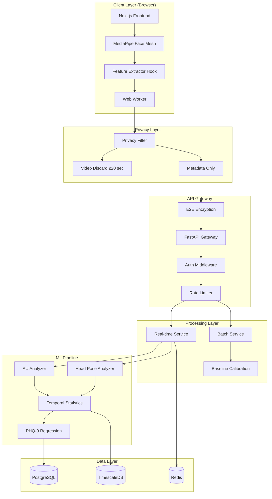

# FacePsy Wellness Platform - System Architecture

## Overview

A privacy-first emotional wellness screening platform based on the FacePsy research paper. The system analyzes facial behavior and head gestures to predict PHQ-9 depression scores without storing any images.

## System Architecture Diagram



## Core Components

### 1. Frontend (Next.js + TypeScript)

#### useFacePsy Hook (`/frontend/src/hooks/useFacePsy.ts`)

The main React hook for facial feature extraction:

```typescript
// Key features extracted (151 signals as per FacePsy paper):
interface FacialFrame {
  timestamp: number;
  headPose: HeadPose;       // Pitch, Yaw, Roll (Euler angles)
  eyeMetrics: EyeMetrics;   // EAR, blink detection
  actionUnits: ActionUnits; // 12 AUs (focus on AU 2, 6, 7, 12, 15, 17)
  geometricFeatures: GeometricFeatures;
  smileProbability: number;
}
```

**Key Technical Details:**
- Sampling Rate: 2.5 FPS (as per paper)
- Window Duration: 10 seconds
- Image Retention: ≤20 seconds
- Landmark Count: 468 points (MediaPipe Face Mesh)

#### PHQ-9 Predictor (`/frontend/src/lib/phq9-predictor.ts`)

Implements the depression prediction logic:

```typescript
// Feature weights based on FacePsy research
const FEATURE_WEIGHTS = {
  AU15: 0.20,   // Lip Corner Depressor (strongest predictor)
  AU12: 0.18,   // Lip Corner Puller (smile)
  AU06: 0.15,   // Cheek Raiser
  headMovement: 0.15,
  AU02: 0.12,   // Outer Brow Raiser
  expressionVariability: 0.10,
  AU07: 0.10,   // Lid Tightener
  AU17: 0.08,   // Chin Raiser
};
```

### 2. Backend (FastAPI + Python)

Located in `/backend/main.py`:
- Face landmark detection with MediaPipe Tasks API
- Action Unit detection with TFLite model (`AU_200.tflite`)
- Head pose calculation from transformation matrices
- Smile probability from multiple signals

### 3. ML Models

| Model | Purpose | Input | Output |
|-------|---------|-------|--------|
| `face_landmarker.task` | Face detection + landmarks | RGB Image | 468 landmarks, blendshapes |
| `AU_200.tflite` | Action Unit detection | 200x200 grayscale | 12 AU intensities |

## PHQ-9 Prediction Algorithm

### Step 1: Feature Extraction (Client-side)

```typescript
// Extract at 2.5 FPS for 10-second windows
for each frame:
    landmarks = MediaPipe.detect(frame)
    headPose = calculateEulerAngles(landmarks)
    AUs = estimateActionUnits(landmarks)
    EAR = calculateEyeAspectRatio(landmarks)
```

### Step 2: Window Statistics

```typescript
// Calculate mean and standard deviation over window
windowStats = {
    headPose: { pitch: {mean, std, range}, yaw: {...}, roll: {...} },
    actionUnits: { AU01: {mean, std}, AU02: {...}, ... },
    eyeMetrics: { blinkRate, avgEAR },
    smileProbability: { mean, std }
}
```

### Step 3: Depression Scoring

```typescript
// Weight-based scoring with personalized baseline
for each feature in KEY_FEATURES:
    deviation = current[feature] - baseline[feature]
    if deviation exceeds threshold:
        riskScore += deviation * weight[feature]

// Normalize to PHQ-9 scale (0-27)
phq9Score = sigmoid((riskScore - 0.3) * 8) * 27
```

### PHQ-9 Severity Mapping

| Score | Severity | Thai Label |
|-------|----------|------------|
| 0-4 | Minimal | ปกติ |
| 5-9 | Mild | เล็กน้อย |
| 10-14 | Moderate | ปานกลาง |
| 15-19 | Moderately Severe | ค่อนข้างรุนแรง |
| 20-27 | Severe | รุนแรง |

## Privacy Architecture

### Data Flow (Privacy-by-Design)

```
Camera → MediaPipe (in-browser) → Feature Extraction → Delete Image
                                        ↓
                              Numeric Metadata Only
                                        ↓
                              E2E Encryption → API
```

### What We Store

| Data Type | Stored? | Duration |
|-----------|---------|----------|
| Raw Images | NO | Deleted within 20s |
| Video | NO | Never recorded |
| Audio | NO | Not captured |
| Facial Landmarks | NO | Processed only |
| AU Statistics | YES | User-controlled |
| PHQ-9 Scores | YES | User-controlled |

## Monetization Strategy

### B2C (Freemium Model)

| Tier | Price | Features |
|------|-------|----------|
| **Free** | ฿0 | 3 scans/month, basic results |
| **Pro** | ฿199/mo | Unlimited scans, history, PDF reports |
| **Premium** | ฿499/mo | + Expert consultation, advanced insights |

### B2B (Enterprise)

| Package | Target | Features |
|---------|--------|----------|
| **Team** | SME (10-50) | Anonymous team dashboard, basic API |
| **Enterprise** | Corporate | Full API, custom branding, SSO |
| **Healthcare** | Clinics | HIPAA compliance, therapist dashboard |

### Revenue Projections

```
Year 1 MVP:
- 10,000 free users @ 3% conversion = 300 Pro users
- 300 × ฿199 × 12 = ฿718,800/year

Year 2 Scale:
- 50,000 free users @ 5% conversion = 2,500 Pro users
- + 10 B2B clients @ ฿50,000/year = ฿500,000
- Total: ฿6,470,000/year
```

## MVP Feature Checklist

### Phase 1 (MVP - 4 weeks)

- [x] Landing page with trust signals
- [x] Consent flow with privacy explanation
- [x] Face scanning with real-time feedback
- [x] PHQ-9 prediction display
- [x] Basic recommendations
- [ ] User authentication (optional)
- [ ] Result history (localStorage)

### Phase 2 (Growth - 8 weeks)

- [ ] Dashboard with trends
- [ ] Daily check-in reminders
- [ ] PDF report generation
- [ ] Stripe payment integration
- [ ] Email notifications

### Phase 3 (Scale - 12 weeks)

- [ ] B2B admin dashboard
- [ ] API for integrations
- [ ] Mobile app (React Native)
- [ ] Multi-language support
- [ ] A/B testing framework

## Tech Stack Summary

| Layer | Technology |
|-------|------------|
| Frontend | Next.js 14, TypeScript, Tailwind CSS |
| Vision | MediaPipe Face Mesh (client-side) |
| Backend | FastAPI, Python 3.13 |
| ML | TensorFlow Lite, Custom AU model |
| Database | PostgreSQL + TimescaleDB |
| Cache | Redis |
| Auth | NextAuth.js / Supabase |
| Payments | Stripe |
| Hosting | Vercel (frontend), Railway (backend) |

## Running the Project

### Frontend

```bash
cd frontend
npm install
npm run dev
# Open http://localhost:3000
```

### Backend

```bash
cd backend
source venv/bin/activate
pip install -r requirements.txt
uvicorn main:app --reload
# API at http://localhost:8000
```

## Key Research References

- **FacePsy Paper**: [GitHub](https://github.com/stevenshci/FacePsy)
- **PHQ-9 Scale**: Patient Health Questionnaire-9
- **FACS**: Facial Action Coding System (Ekman & Friesen)
- **MediaPipe**: Google's face mesh solution

## Disclaimer

This system provides preliminary emotional wellness screening only. Results are NOT medical diagnoses. Users with mental health concerns should consult qualified healthcare professionals.
